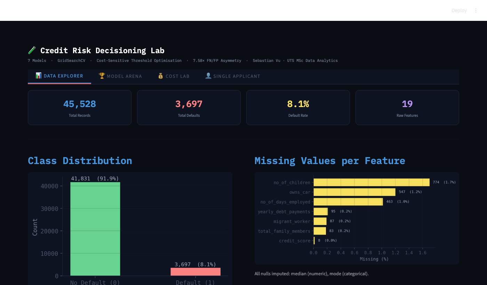
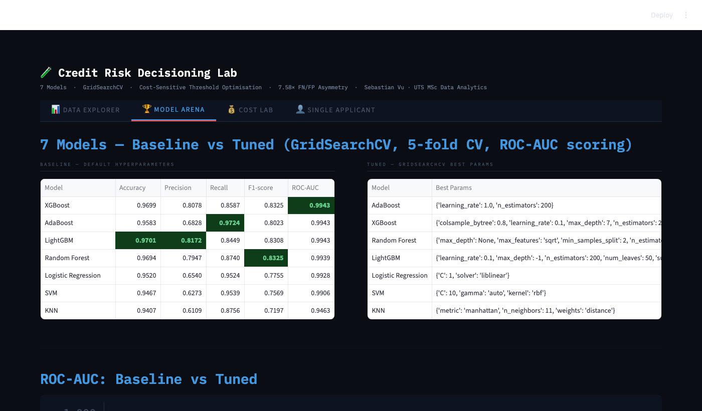

# 🧪 Credit Risk Decisioning Lab

> An interactive ML dashboard for credit card default prediction with cost-sensitive threshold optimisation — built as an extension of an academic assignment at UTS.

[](https://credit-risk-app-uts.streamlit.app)
&nbsp;


---

## 📸 Demo

### 📊 Data Explorer — Dataset profiling at a glance

*45,528 records · 8.1% default rate · class imbalance visualised · missing value audit*

---

### 🏆 Model Arena — 7 models, baseline vs GridSearchCV-tuned

*All models achieve ROC-AUC > 0.94. But is that the whole story?*

---

### 💰 Cost Lab — Where the real insight lives

*Same model, smarter threshold: **$290k → $94k** (67.7% cost reduction). Interactive slider lets you explore the FN/FP trade-off in real time.*

---

### 👤 Single Applicant — Real-time credit decisioning

*Input any applicant profile → instant default probability + APPROVE / REJECT decision + risk signal breakdown*

---

## 🎯 The Core Insight

Standard ML benchmarks declare every model "excellent" at ROC-AUC > 0.94.  
But in credit risk, **missing one defaulter costs $1,922.58** while **rejecting a good customer costs only $253.74** — a **7.58× asymmetry** that ROC-AUC is completely blind to.

| Strategy | Cost at t = 0.50 | Cost at optimal t* | Saving |
|---|---|---|---|
| Raw model (no tuning) | **$290,192** | **$93,669** | **67.7%** |
| Class-Weighted | $229,529 | $89,570 | 61.0% |
| SMOTE | $259,675 | $93,308 | 64.1% |
| Calibrated (isotonic) | $313,234 | $91,239 | 70.9% |
| Custom Cost Objective | $222,092 | $91,747 | 58.7% |

> **Same data. Same model architecture. Just a smarter decision threshold.**

---

## ✨ Features

| Tab | What you get |
|---|---|
| **📊 Data Explorer** | Dataset stats, class imbalance, missing values, feature correlations, default rate by occupation |
| **🏆 Model Arena** | Baseline vs tuned metric tables, ROC-AUC grouped bar chart, full metric breakdown |
| **💰 Cost Lab** | Interactive threshold slider, cost curve, FN/FP decomposition, confusion matrices, ROC & PR curves. Two modes: **Tuned pkl models** or **5 Reference LightGBM variants** matching notebook figures |
| **👤 Single Applicant** | Real-time scoring for any applicant profile, probability gauge, risk signal cards, cost exposure |

---

## 🛠 Tech Stack

- **Streamlit** — UI framework
- **LightGBM / XGBoost / scikit-learn** — ML models (7 algorithms)
- **GridSearchCV** — hyperparameter tuning (5-fold CV, ROC-AUC scoring)
- **SMOTE** (`imbalanced-learn`) — minority class oversampling
- **Isotonic calibration** — probability calibration
- **Custom cost-sensitive gradient objective** — cost-weighted LightGBM training
- **Matplotlib / Seaborn** — visualisation

---

## 🚀 Run Locally

```bash
git clone https://github.com/vubeoangel/credit-risk-app.git
cd credit-risk-app

python -m venv venv && source venv/bin/activate
pip install -r requirements.txt

streamlit run app.py
```

> **Note:** Random Forest models are excluded from this repo (52MB / 35MB). All other 12 pkl files are included. RF can be regenerated from the training notebook.

---

## 📁 Project Structure

```
credit-risk-lab/
├── app.py                          # Main Streamlit application
├── requirements.txt                # Dependencies
├── runtime.txt                     # Python 3.11 (Streamlit Cloud)
├── data/
│   └── train.csv                   # Dataset (45,528 records, 19 features)
├── models/
│   ├── scaler.pkl                  # Fitted StandardScaler
│   ├── feature_columns.pkl         # 33 feature names after preprocessing
│   ├── tuned_lightgbm.pkl          # ⭐ Best model — AUC 0.9940
│   ├── tuned_xgboost.pkl
│   ├── tuned_adaboost.pkl
│   ├── tuned_svm.pkl
│   ├── tuned_logistic_regression.pkl
│   ├── tuned_knn.pkl
│   └── baseline_*.pkl              # 6 baseline models
├── results/
│   ├── baseline_model_results.csv
│   ├── tuned_model_results.csv
│   └── no_smote_threshold_results.csv
└── assets/                         # Screenshots for README
```

---

## 🔬 Cost-Sensitive Threshold Theory

The Bayes-optimal threshold under asymmetric costs:

$$t^* = \frac{C_{FP}}{C_{FP} + C_{FN}} = \frac{253.74}{253.74 + 1922.58} \approx 0.117$$

In practice, the empirical optimal threshold from the cost sweep differs by model:
- **Raw imbalanced model** → t* ≈ 0.001 (class imbalance biases probabilities downward)
- **SMOTE / tuned model** → t* ≈ 0.013–0.143 (better calibration, closer to theory)

---

## 📓 Background

This app extends an Advanced Analytics & Algorithms assignment (UTS MSc Data Analytics).  
The notebook explored cost-sensitive ML for credit card default prediction — this dashboard makes the entire analytical workflow interactive and deployable.

---

*Sebastian Vu · UTS MSc Data Analytics*
